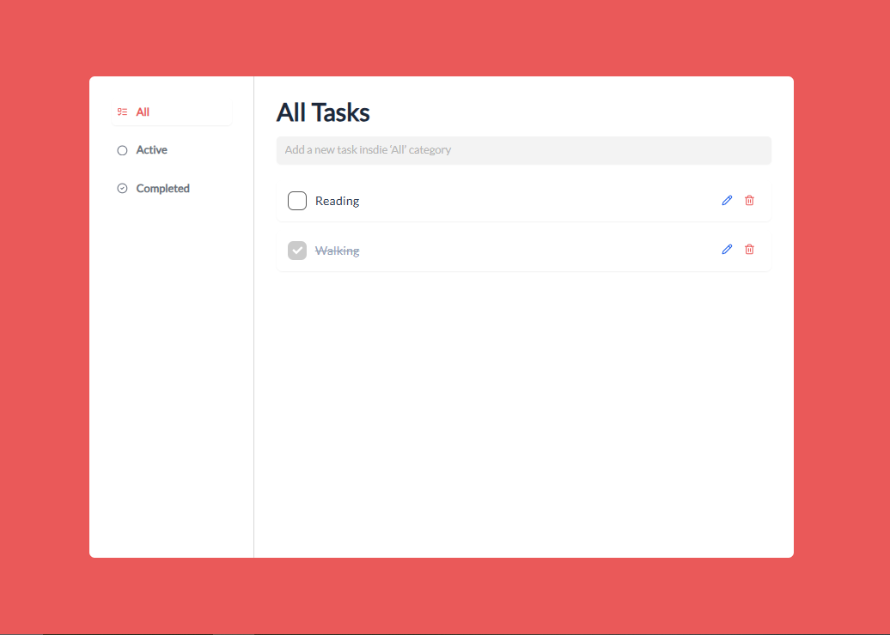
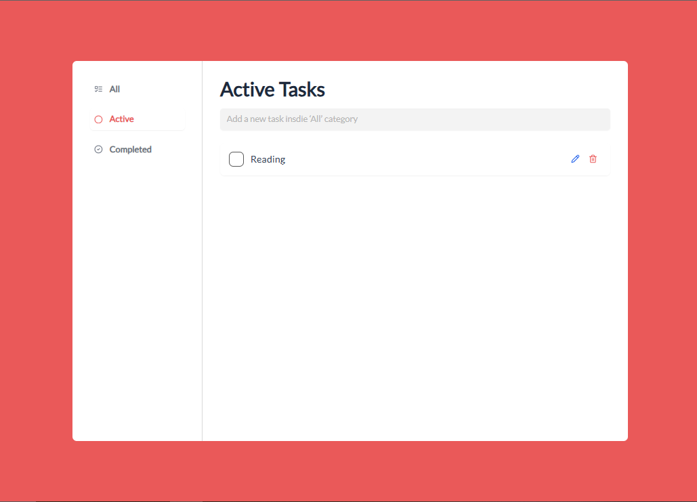
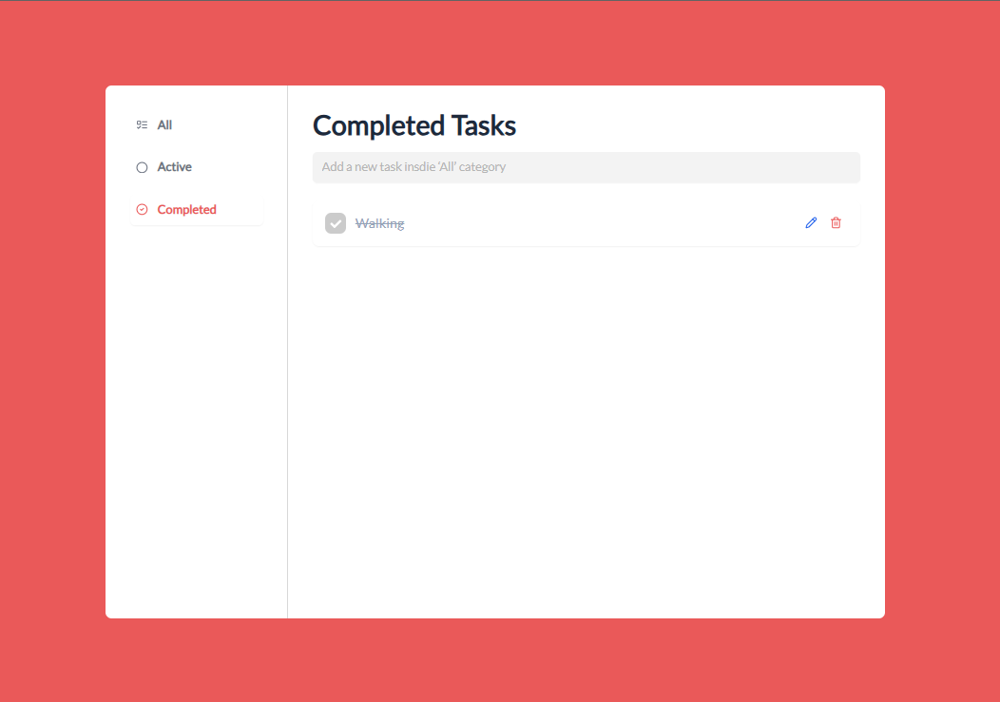

This is a [Next.js](https://nextjs.org) project bootstrapped with [`create-next-app`](https://nextjs.org/docs/app/api-reference/cli/create-next-app).

# Todo App

A simple Todo App built with **Next.js**, **Redux Toolkit**, **TypeScript**, and **Tailwind CSS**. The app allows you to manage tasks with features to add, delete, mark as complete, and filter tasks into three categories: All Tasks, Active Tasks, and Completed Tasks.

## Features

- Add a new task
- Delete a task
- Mark a task as complete
- Display tasks in three different categories:
  - **All Tasks**
  - **Active Tasks**
  - **Completed Tasks**

## Tech Stack

- **Next.js** - A React framework for building web applications with server-side rendering, routing, and more. ([Next.js Documentation](https://nextjs.org/docs))
- **TypeScript** - Adds static typing to JavaScript to make the app more reliable and maintainable.
- **Tailwind CSS** - A utility-first CSS framework for designing modern web interfaces. ([Tailwind CSS Documentation](https://tailwindcss.com/docs/installation))
- **Redux Toolkit** - A library for efficient Redux development, simplifying state management. ([Redux Toolkit Documentation](https://redux-toolkit.js.org/))

## Installation

### Prerequisites

Before running the app, make sure you have the following installed:
- **Node.js** (version 14.x or later)
- **npm** (version 6.x or later) or **yarn**

### Steps

1. **Clone the repository**:

   ```bash
   git clone https://github.com/yourusername/todo-app.git

2. **Navigate to the project directory:**:

   ```bash
   cd todo-app

3. **Install dependencies**:

   ```bash
   npm install
    # or if you prefer yarn
    yarn install

4. **Run the development server**:

   ```bash
   npm run dev
    # or if you prefer yarn
    yarn dev

This will start the app on [http://localhost:3000](http://localhost:3000).


### All Tab


### Active Tab


### Completed Tab
